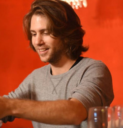

# The Group Idea
{: #group-idea }

<ul>
  
   
    <li>
      <a href="{{site.baseurl | append:  post.url }}">{{ post.title }}</a>
    </li>
   
  
</ul>

# Team Bonding Workshop
{: #tb-ws }
Six sessions, 90 minutes per session, hopfully once a week.

## Session 1: Hello World
Getting to know the Group languege, The foramt (Setting) & the facilitators.

## Session 2: Lunch
Lets see what happend on lunch time, What are we talking about?

## Session 3: Bug Or Feature
How do talk to each other.

## Session 4: Code Review
Communication, Let's review that.

## Session 5: Lost In Translation
English Jerusalem lite talk, why are we do that??

## Session 6: Save & Exit
What happens next, define next sprint.

[Team Bonding Workshop leaflet]({{ site.url | append: site.baseurl}}/assets/pdfs/ws_leaflet.pdf)

# Pilot
{: #pilot }
<ul>
  
   
    <li>
      <a href="{{site.baseurl | append:  post.url }}">{{ post.title }}</a>
    </li>
   
  
</ul>

# About US
{: #about-us }
### Mor Aram
 I'm a social worker, and trained group facilitator.
 and I like to communicate, more than all in Hebrew, my language.
 Can we do that? Thanks
[Just click here](./mor_in_hebrew.md)     
 

### Dror Arm
 
